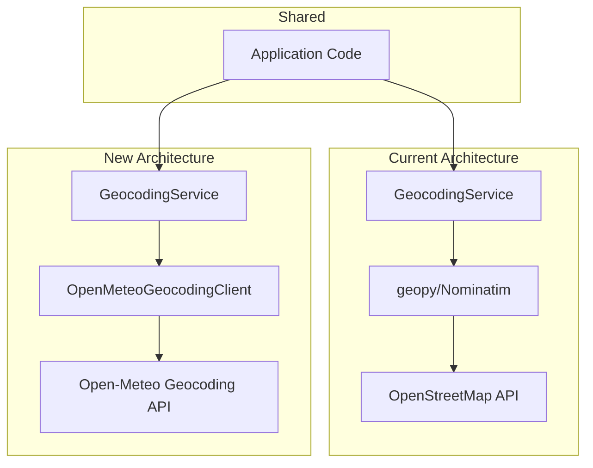

# Design Document: Open-Meteo Geocoding Migration

## Overview

This design describes the migration of AccessiWeather's geocoding functionality from Nominatim/geopy to Open-Meteo's Geocoding API. The migration introduces a new `OpenMeteoGeocodingClient` class that follows the same patterns as the existing `OpenMeteoApiClient`, and updates the `GeocodingService` to use this new client while maintaining backward compatibility.

The Open-Meteo Geocoding API endpoint is: `https://geocoding-api.open-meteo.com/v1/search`

### Key Benefits
- Consistency with existing Open-Meteo weather integration
- No API key required
- Reduced dependencies (removes geopy)
- Additional data: timezone, elevation, population
- Simpler, purpose-built API for weather applications

## Architecture



The architecture maintains the same abstraction layer (`GeocodingService`) that application code uses, but replaces the underlying implementation from geopy/Nominatim to a custom `OpenMeteoGeocodingClient`.

## Components and Interfaces

### OpenMeteoGeocodingClient

New class in `src/accessiweather/openmeteo_geocoding_client.py`:

```python
class OpenMeteoGeocodingClient:
    """Client for the Open-Meteo Geocoding API."""

    BASE_URL = "https://geocoding-api.open-meteo.com/v1"

    def __init__(
        self,
        user_agent: str = "AccessiWeather",
        timeout: float = 30.0,
        max_retries: int = 3,
        retry_delay: float = 1.0,
    ) -> None: ...

    def search(
        self,
        name: str,
        count: int = 10,
        language: str = "en",
    ) -> list[GeocodingResult]: ...

    def close(self) -> None: ...
```

### GeocodingResult

New dataclass for structured geocoding results:

```python
@dataclass
class GeocodingResult:
    """Structured result from geocoding API."""
    name: str
    latitude: float
    longitude: float
    country: str
    country_code: str
    timezone: str
    admin1: str | None = None  # State/Province
    admin2: str | None = None  # County
    admin3: str | None = None  # City district
    elevation: float | None = None
    population: int | None = None

    @property
    def display_name(self) -> str:
        """Generate human-readable display name."""
        parts = [self.name]
        if self.admin1:
            parts.append(self.admin1)
        parts.append(self.country)
        return ", ".join(parts)
```

### Updated GeocodingService

The existing `GeocodingService` class will be updated to use `OpenMeteoGeocodingClient` internally while maintaining the same public interface:

```python
class GeocodingService:
    """Service for geocoding addresses and zip codes."""

    def __init__(
        self,
        user_agent: str = "AccessiWeather",
        timeout: int = 10,
        data_source: str = "nws"
    ) -> None:
        self.client = OpenMeteoGeocodingClient(
            user_agent=user_agent,
            timeout=float(timeout),
        )
        self.data_source = data_source

    # Existing methods maintained for backward compatibility:
    def is_zip_code(self, text: str) -> bool: ...
    def format_zip_code(self, zip_code: str) -> str: ...
    def geocode_address(self, address: str) -> tuple[float, float, str] | None: ...
    def validate_coordinates(self, lat: float, lon: float, us_only: bool | None = None) -> bool: ...
    def suggest_locations(self, query: str, limit: int = 5) -> list[str]: ...
```

### Exception Classes

New exceptions in `src/accessiweather/openmeteo_geocoding_client.py`:

```python
class OpenMeteoGeocodingError(Exception):
    """Base exception for Open-Meteo Geocoding API errors."""

class OpenMeteoGeocodingApiError(OpenMeteoGeocodingError):
    """Exception raised for API errors (4xx, 5xx responses)."""

class OpenMeteoGeocodingNetworkError(OpenMeteoGeocodingError):
    """Exception raised for network-related errors (timeout, connection)."""
```

## Data Models

### Open-Meteo Geocoding API Response

The API returns JSON with this structure:

```json
{
  "results": [
    {
      "id": 5128581,
      "name": "New York",
      "latitude": 40.71427,
      "longitude": -74.00597,
      "elevation": 10.0,
      "feature_code": "PPL",
      "country_code": "US",
      "country": "United States",
      "timezone": "America/New_York",
      "population": 8804190,
      "admin1": "New York",
      "admin2": "New York County",
      "admin3": null,
      "admin4": null
    }
  ],
  "generationtime_ms": 0.5
}
```

### Internal Data Flow

1. User enters search query → `GeocodingService.geocode_address()`
2. Service detects ZIP code format → formats query if needed
3. Service calls `OpenMeteoGeocodingClient.search()`
4. Client makes HTTP request to Open-Meteo API
5. Client parses response into `list[GeocodingResult]`
6. Service filters results based on `data_source` (US-only for NWS)
7. Service returns `(latitude, longitude, display_name)` tuple

## Correctness Properties

*A property is a characteristic or behavior that should hold true across all valid executions of a system-essentially, a formal statement about what the system should do. Properties serve as the bridge between human-readable specifications and machine-verifiable correctness guarantees.*

### Property 1: API response parsing extracts all required fields
*For any* valid Open-Meteo Geocoding API response JSON, parsing it into `GeocodingResult` objects SHALL preserve all required fields (name, latitude, longitude, country, country_code, timezone) without data loss.
**Validates: Requirements 1.2**

### Property 2: ZIP code detection is consistent
*For any* string matching the pattern `^\d{5}$` (5 digits) or `^\d{5}-\d{4}$` (ZIP+4), `is_zip_code()` SHALL return True; for any string not matching these patterns, it SHALL return False.
**Validates: Requirements 1.3**

### Property 3: Suggestion count respects limit parameter
*For any* search query and positive integer limit, `suggest_locations()` SHALL return at most `limit` results.
**Validates: Requirements 2.1**

### Property 4: Display text contains required components
*For any* `GeocodingResult` with non-null name and country, the `display_name` property SHALL contain both the name and country.
**Validates: Requirements 2.2**

### Property 5: NWS data source filters to US-only locations
*For any* set of geocoding results containing mixed country codes, when `data_source` is "nws", filtering SHALL return only results where `country_code` is "US".
**Validates: Requirements 2.3**

### Property 6: Non-NWS data source returns worldwide locations
*For any* set of geocoding results, when `data_source` is not "nws", filtering SHALL return all results regardless of country code.
**Validates: Requirements 2.4**

### Property 7: Coordinate validation bounds check
*For any* latitude and longitude values, `validate_coordinates()` with `us_only=False` SHALL return True if and only if `-90 <= latitude <= 90` AND `-180 <= longitude <= 180`.
**Validates: Requirements 4.1, 4.2**

### Property 8: Non-NWS accepts any valid global coordinates
*For any* coordinates within valid bounds (-90 to 90 lat, -180 to 180 lon) and `data_source` not equal to "nws", `validate_coordinates()` SHALL return True without performing reverse geocoding.
**Validates: Requirements 4.4**

## Error Handling

### Network Errors
- Timeout: Retry up to `max_retries` times with `retry_delay` between attempts
- Connection errors: Same retry logic as timeout
- After all retries exhausted: Raise `OpenMeteoGeocodingNetworkError`

### API Errors
- HTTP 400 (Bad Request): Raise `OpenMeteoGeocodingApiError` with error message from response
- HTTP 429 (Rate Limit): Raise `OpenMeteoGeocodingApiError` indicating rate limiting
- HTTP 5xx (Server Error): Retry, then raise `OpenMeteoGeocodingApiError`

### Application-Level Handling
- `GeocodingService` catches all exceptions from the client
- Logs errors appropriately
- Returns `None` or empty list to callers (graceful degradation)
- Never propagates exceptions to UI layer

## Testing Strategy

### Dual Testing Approach

Both unit tests and property-based tests will be used:
- **Unit tests**: Verify specific examples, edge cases, and error conditions
- **Property-based tests**: Verify universal properties that should hold across all inputs

### Property-Based Testing

The project will use **Hypothesis** for property-based testing, consistent with existing tests in `tests/test_geocoding_properties.py`.

Each property-based test will:
- Run a minimum of 100 iterations
- Be tagged with a comment referencing the correctness property it implements
- Use the format: `**Feature: openmeteo-geocoding, Property {number}: {property_text}**`

### Test Categories

1. **OpenMeteoGeocodingClient Unit Tests**
   - Request construction (URL, parameters)
   - Response parsing (valid JSON, missing fields)
   - Error handling (HTTP errors, network errors)
   - Retry logic verification

2. **GeocodingService Property Tests**
   - ZIP code validation (Property 2)
   - Coordinate validation (Property 7, 8)
   - Result filtering (Property 5, 6)
   - Suggestion limits (Property 3)

3. **Integration Tests** (marked `@pytest.mark.integration`)
   - Real API calls to Open-Meteo Geocoding
   - End-to-end geocoding flow
   - Skipped in CI, run manually

### Test File Structure

```
tests/
├── test_openmeteo_geocoding_client.py  # Unit tests for client
├── test_geocoding_properties.py        # Property-based tests (update existing)
└── test_geocoding_integration.py       # Integration tests (new)
```
