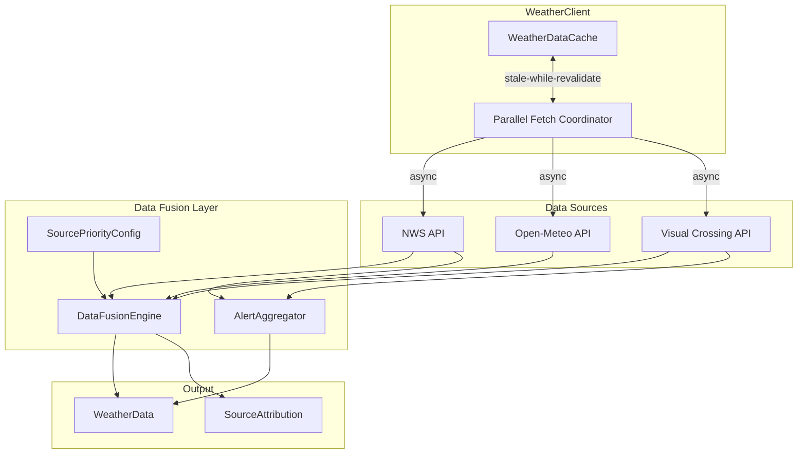

# Design Document: Smart Auto Source

## Overview

The Smart Auto Source feature transforms AccessiWeather's data fetching strategy from a single-source-with-fallback model to an intelligent multi-source aggregation system. When the data source is set to "auto", the system will proactively fetch weather data from all available sources (NWS, Open-Meteo, Visual Crossing) in parallel, then intelligently merge the results using a configurable priority system to produce the most complete and accurate weather information.

### Key Design Goals

1. **Completeness**: Fill data gaps by combining fields from multiple sources
2. **Accuracy**: Use source-specific priorities based on data quality for each metric type
3. **Performance**: Parallel fetching with timeouts and stale-while-revalidate caching
4. **Transparency**: Track and display source attribution for merged data
5. **Resilience**: Graceful degradation when sources fail

## Architecture



## Components and Interfaces

### 1. DataFusionEngine

The core component responsible for merging weather data from multiple sources.

```python
@dataclass
class SourceData:
    """Container for data from a single source."""
    source: str  # "nws", "openmeteo", "visualcrossing"
    current: CurrentConditions | None
    forecast: Forecast | None
    hourly_forecast: HourlyForecast | None
    alerts: WeatherAlerts | None
    fetch_time: datetime
    success: bool
    error: str | None = None


class DataFusionEngine:
    """Merges weather data from multiple sources using configurable priorities."""

    def __init__(self, config: SourcePriorityConfig):
        self.config = config
        self.attribution: dict[str, str] = {}

    def merge_current_conditions(
        self,
        sources: list[SourceData],
        location: Location
    ) -> tuple[CurrentConditions, dict[str, str]]:
        """
        Merge current conditions from multiple sources.

        Returns merged conditions and field-level source attribution.
        """
        ...

    def merge_forecasts(
        self,
        sources: list[SourceData],
        location: Location
    ) -> tuple[Forecast, dict[str, str]]:
        """Merge forecast data, preferring higher temporal resolution."""
        ...

    def merge_hourly_forecasts(
        self,
        sources: list[SourceData],
        location: Location
    ) -> tuple[HourlyForecast, dict[str, str]]:
        """Merge hourly forecasts into unified timeline."""
        ...
```

### 2. AlertAggregator

Handles alert collection and deduplication from NWS and Visual Crossing.

```python
class AlertAggregator:
    """Aggregates and deduplicates alerts from multiple sources."""

    def aggregate_alerts(
        self,
        nws_alerts: WeatherAlerts | None,
        vc_alerts: WeatherAlerts | None
    ) -> WeatherAlerts:
        """
        Combine alerts from NWS and Visual Crossing.

        Deduplicates based on event type, area, and time window.
        Preserves most detailed description when merging duplicates.
        """
        ...

    def _is_duplicate(
        self,
        alert1: WeatherAlert,
        alert2: WeatherAlert,
        time_window_minutes: int = 60
    ) -> bool:
        """Check if two alerts describe the same event."""
        ...

    def _merge_duplicate_alerts(
        self,
        alerts: list[WeatherAlert]
    ) -> WeatherAlert:
        """Merge duplicate alerts, keeping most detailed info."""
        ...
```

### 3. SourcePriorityConfig

Configuration for source priorities per field type.

```python
@dataclass
class FieldPriority:
    """Priority ordering for a specific field."""
    field_name: str
    priorities: list[str]  # e.g., ["nws", "visualcrossing", "openmeteo"]


@dataclass
class SourcePriorityConfig:
    """Configuration for data fusion priorities."""

    # Default priorities by location type
    us_default: list[str] = field(
        default_factory=lambda: ["nws", "openmeteo", "visualcrossing"]
    )
    international_default: list[str] = field(
        default_factory=lambda: ["openmeteo", "visualcrossing"]
    )

    # Per-field overrides
    field_priorities: dict[str, list[str]] = field(default_factory=dict)

    # Conflict threshold for temperature (°F)
    temperature_conflict_threshold: float = 5.0

    def get_priority(self, field_name: str, is_us: bool) -> list[str]:
        """Get priority order for a field."""
        if field_name in self.field_priorities:
            return self.field_priorities[field_name]
        return self.us_default if is_us else self.international_default

    def to_json(self) -> str:
        """Serialize to JSON."""
        ...

    @classmethod
    def from_json(cls, json_str: str) -> "SourcePriorityConfig":
        """Deserialize from JSON."""
        ...
```

### 4. SourceAttribution

Tracks which source provided each piece of data.

```python
@dataclass
class SourceAttribution:
    """Tracks source attribution for merged data."""

    # Field name -> source name
    field_sources: dict[str, str] = field(default_factory=dict)

    # Conflicts detected during merge
    conflicts: list[DataConflict] = field(default_factory=list)

    # Sources that contributed to this data
    contributing_sources: set[str] = field(default_factory=set)

    # Sources that failed
    failed_sources: set[str] = field(default_factory=set)


@dataclass
class DataConflict:
    """Records a conflict between sources."""
    field_name: str
    values: dict[str, Any]  # source -> value
    selected_source: str
    selected_value: Any
```

### 5. ParallelFetchCoordinator

Manages concurrent fetching from all sources.

```python
class ParallelFetchCoordinator:
    """Coordinates parallel fetching from multiple sources."""

    def __init__(
        self,
        nws_client: WeatherClient,
        openmeteo_client: OpenMeteoApiClient,
        visual_crossing_client: VisualCrossingClient | None,
        timeout: float = 5.0
    ):
        self.timeout = timeout
        ...

    async def fetch_all(
        self,
        location: Location,
        include_alerts: bool = True
    ) -> list[SourceData]:
        """
        Fetch from all available sources in parallel.

        Uses asyncio.gather with return_exceptions=True to handle
        individual source failures without blocking others.
        """
        ...

    async def _fetch_with_timeout(
        self,
        coro: Coroutine,
        source_name: str
    ) -> SourceData:
        """Wrap a fetch coroutine with timeout handling."""
        ...
```

## Data Models

### Enhanced WeatherData

```python
@dataclass
class WeatherData:
    """Complete weather data for a location."""

    location: Location
    current: CurrentConditions | None = None
    forecast: Forecast | None = None
    hourly_forecast: HourlyForecast | None = None
    discussion: str | None = None
    alerts: WeatherAlerts | None = None
    environmental: EnvironmentalConditions | None = None
    aviation: AviationData | None = None
    trend_insights: list[TrendInsight] = field(default_factory=list)

    # New fields for smart auto source
    source_attribution: SourceAttribution | None = None
    incomplete_sections: set[str] = field(default_factory=set)

    # Existing stale tracking
    stale: bool = False
    stale_since: datetime | None = None
    stale_reason: str | None = None
```

## Error Handling

### Source Failure Handling

```python
async def _handle_source_failure(
    self,
    source_name: str,
    error: Exception,
    location: Location
) -> SourceData:
    """Handle a source failure gracefully."""
    logger.warning(f"Source {source_name} failed for {location.name}: {error}")

    return SourceData(
        source=source_name,
        current=None,
        forecast=None,
        hourly_forecast=None,
        alerts=None,
        fetch_time=datetime.now(UTC),
        success=False,
        error=str(error)
    )
```

### Timeout Handling

```python
async def _fetch_with_timeout(
    self,
    coro: Coroutine[Any, Any, T],
    source_name: str,
    timeout: float
) -> T | None:
    """Execute coroutine with timeout, returning None on timeout."""
    try:
        return await asyncio.wait_for(coro, timeout=timeout)
    except asyncio.TimeoutError:
        logger.warning(f"Source {source_name} timed out after {timeout}s")
        return None
```

## Testing Strategy

### Dual Testing Approach

This feature requires both unit tests and property-based tests:

- **Unit tests**: Verify specific examples, edge cases, and integration points
- **Property-based tests**: Verify universal properties hold across all inputs

### Property-Based Testing Framework

We will use **Hypothesis** for property-based testing, which is already available in the project's test dependencies.

Each property-based test will:
1. Run a minimum of 100 iterations
2. Be tagged with the correctness property it implements
3. Use smart generators that constrain to valid input spaces


## Correctness Properties

*A property is a characteristic or behavior that should hold true across all valid executions of a system-essentially, a formal statement about what the system should do. Properties serve as the bridge between human-readable specifications and machine-verifiable correctness guarantees.*

### Property 1: Parallel Fetch Executes All Sources Concurrently

*For any* location and auto mode configuration, when fetching weather data, all available source requests SHALL be initiated concurrently (not sequentially), and the total fetch time SHALL be bounded by the slowest individual source plus overhead, not the sum of all source times.

**Validates: Requirements 1.1, 5.1**

### Property 2: Source Failure Isolation

*For any* set of source responses where at least one source succeeds, the WeatherClient SHALL produce a valid WeatherData object containing data from all successful sources, regardless of which sources failed.

**Validates: Requirements 1.3, 8.1**

### Property 3: Stale Cache Fallback

*For any* location with cached data, when all sources fail, the WeatherClient SHALL return the cached data with `stale=True` and `stale_reason` set to indicate the failure.

**Validates: Requirements 1.4**

### Property 4: Priority-Based Field Merging

*For any* set of current conditions from multiple sources and a priority configuration, the DataFusionEngine SHALL select each field value from the highest-priority source that provides a non-None value for that field.

**Validates: Requirements 2.1, 2.3, 3.3, 7.2**

### Property 5: Temperature Conflict Resolution

*For any* set of current conditions where temperature values differ by more than the configured threshold (default 5°F), the DataFusionEngine SHALL use the temperature from the highest-priority source for that location type.

**Validates: Requirements 2.2**

### Property 6: No Data Loss During Merge

*For any* set of source data, the merged CurrentConditions SHALL contain a non-None value for every field that has a non-None value in at least one source input.

**Validates: Requirements 2.4**

### Property 7: Forecast Timeline Unification

*For any* set of forecasts from multiple sources, the merged Forecast SHALL contain all unique time periods from all sources, with no duplicate periods for the same time range.

**Validates: Requirements 3.1**

### Property 8: Forecast Field Preservation

*For any* merged forecast, if any source provides precipitation_probability, uv_index, or snowfall for a period, that value SHALL appear in the merged output for that period.

**Validates: Requirements 3.4**

### Property 9: Alert Source Collection

*For any* location, the AlertAggregator SHALL collect alerts from exactly NWS and Visual Crossing (when configured), and SHALL NOT attempt to fetch alerts from Open-Meteo.

**Validates: Requirements 4.1**

### Property 10: Alert Deduplication Correctness

*For any* set of alerts where two alerts have the same event type, overlapping areas, and onset times within 60 minutes, the AlertAggregator SHALL merge them into a single alert.

**Validates: Requirements 4.2**

### Property 11: Alert Detail Preservation

*For any* set of duplicate alerts being merged, the resulting alert SHALL have a description length greater than or equal to the longest description among the duplicates.

**Validates: Requirements 4.3**

### Property 12: Alert Source Attribution

*For any* merged alert, the `source` field SHALL be non-empty and SHALL indicate the originating source(s).

**Validates: Requirements 4.4**

### Property 13: Request Timeout Enforcement

*For any* source request that takes longer than the configured timeout (default 5 seconds), the ParallelFetchCoordinator SHALL cancel that request and proceed with data from other sources.

**Validates: Requirements 1.2, 5.2**

### Property 14: Stale-While-Revalidate Behavior

*For any* location with valid cached data, the WeatherClient SHALL return the cached data within 100ms while initiating a background refresh.

**Validates: Requirements 5.3**

### Property 15: Source Attribution Tracking

*For any* merged WeatherData, the `source_attribution.field_sources` dictionary SHALL contain an entry for every non-None field in the merged data, mapping to the source that provided it.

**Validates: Requirements 6.2**

### Property 16: Configuration Round-Trip

*For any* valid SourcePriorityConfig, serializing to JSON and deserializing back SHALL produce an equivalent configuration object.

**Validates: Requirements 7.4**

### Property 17: Default Priority Application

*For any* field not explicitly configured in SourcePriorityConfig, the DataFusionEngine SHALL use the location-appropriate default priority (US: NWS > Open-Meteo > Visual Crossing; International: Open-Meteo > Visual Crossing).

**Validates: Requirements 7.3**

### Property 18: Partial Data Completeness Tracking

*For any* WeatherData constructed from partial source responses, the `incomplete_sections` set SHALL contain the names of all sections that could not be populated due to source failures.

**Validates: Requirements 8.2**
