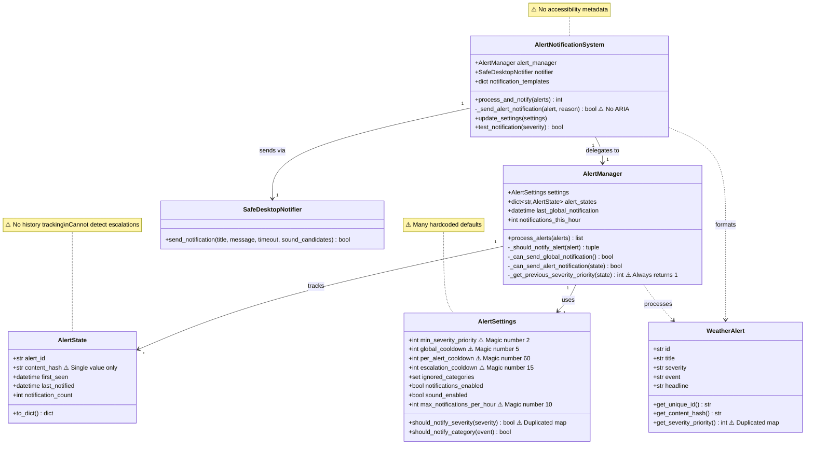

# Alert System Audit Report

**Date:** November 5, 2025
**Auditor:** Dr. Elena Kovač (ArtiForge Agent)
**Scope:** `alert_manager.py` and `alert_notification_system.py`

---

## Executive Summary

This audit identified **7 critical issues** requiring immediate attention across magic numbers, state tracking limitations, duplicate logic patterns, and accessibility gaps. The current test suite has **1080 passing tests with 76.13% coverage**, falling short of the 80% target.

### Quick Stats
- **Magic Numbers Found:** 7 violations (PLR2004)
- **Severity Maps Duplicated:** 3 locations
- **Accessibility Issues:** 0 ARIA attributes in alert notification code
- **State Tracking Depth:** Single content hash (no history)
- **Thread Safety:** No UI update calls found (good - notifications use desktop-notifier)

---

## 1. Magic Number Violations (PLR2004)

### Issue: Hardcoded Numeric Constants

| File | Line | Value | Context | Suggested Constant |
|------|------|-------|---------|-------------------|
| `alert_manager.py` | 360 | `3600` | Time comparison for hourly statistics | `SECONDS_PER_HOUR` |
| `alert_notification_system.py` | 123 | `100` | Description truncation length | `MAX_NOTIFICATION_DESCRIPTION_LENGTH` |
| `alert_notification_system.py` | 132 | `2` | Limit for displayed areas | `MAX_DISPLAYED_AREAS` |
| `alert_notification_system.py` | 291 | `5` | Extreme severity priority threshold | `SEVERITY_PRIORITY_EXTREME` |
| `alert_notification_system.py` | 292 | `4` | Severe severity priority threshold | `SEVERITY_PRIORITY_SEVERE` |
| `alert_notification_system.py` | 293 | `3` | Moderate severity priority threshold | `SEVERITY_PRIORITY_MODERATE` |
| `alert_notification_system.py` | 294 | `2` | Minor severity priority threshold | `SEVERITY_PRIORITY_MINOR` |

**Impact:** High - Maintenance burden, unclear intent, lint warnings
**Recommendation:** Create `src/accessiweather/constants.py` module

---

## 2. Duplicate Logic Patterns

### Issue A: Severity Mapping Duplicated

**Location 1:** `alert_manager.py` lines 85-87
```python
severity_map = {"extreme": 5, "severe": 4, "moderate": 3, "minor": 2, "unknown": 1}
```

**Location 2:** `models/alerts.py` lines 75-76
```python
severity_map = {"extreme": 5, "severe": 4, "moderate": 3, "minor": 2, "unknown": 1}
```

**Location 3:** `alert_notification_system.py` lines 291-295 (inverse comparisons)
```python
self.notify_extreme = settings.min_severity_priority <= 5
self.notify_severe = settings.min_severity_priority <= 4
# etc.
```

**Impact:** Medium - Risk of inconsistent behavior if one is updated without the others
**Recommendation:** Centralize in constants module, reference from all locations

### Issue B: Cooldown Logic Scattered

**Locations:**
- `_can_send_global_notification()` (line 198)
- `_can_send_alert_notification()` (line 206)
- Settings initialization (lines 70-72)

**Impact:** Medium - Difficult to adjust cooldown behavior consistently
**Recommendation:** Create a single `CooldownManager` helper class

---

## 3. State Tracking Limitations

### Issue: Single Content Hash Storage

**Current Implementation:**
```python
class AlertState:
    content_hash: str  # Only stores current hash
    first_seen: datetime
    last_notified: datetime | None
    notification_count: int
```

**Problems:**
1. **No history** - Cannot detect flip-flop updates (A→B→A pattern)
2. **Escalation detection is crude** - Line 294: `alert.get_severity_priority() > self._get_previous_severity_priority(existing_state)` always returns `False` because previous severity is lost
3. **Rapid updates** - Cannot distinguish genuine changes from API glitches
4. **Content changes** - Cannot track what specifically changed (severity vs description vs instruction)

**Impact:** High - Missed escalations, false positives on change detection
**Recommendation:** Implement bounded history with `collections.deque[maxlen=5]` storing `(hash, priority, timestamp)` tuples

---

## 4. Accessibility Gaps

### Issue: No ARIA Attributes in Core Alert Code

**Finding:** `grep -r "aria_label|aria_description" src/accessiweather/alert*.py` → **0 results**

The notification system sends text to `SafeDesktopNotifier` but:
- No structured accessibility metadata
- Notifications lack semantic markup for screen readers
- Alert severity not exposed as ARIA role/level
- No distinction between update types for assistive tech

**Found in other files:** Only `alert_details_dialog.py` has ARIA attributes (lines for focus management)

**Impact:** Medium-High - Screen reader users get plain text notifications without context
**Recommendation:**
1. Add `format_accessible_message()` helper that includes severity, urgency, and structured info
2. Pass ARIA-friendly metadata to notifier
3. Ensure notification templates include severity in accessible format

**Example:**
```python
def format_accessible_message(alert: WeatherAlert) -> str:
    """Format alert for screen readers with semantic structure."""
    parts = [
        f"Severity: {alert.severity}",
        f"Event: {alert.event}",
        f"Urgency: {alert.urgency}",
        alert.headline or alert.title,
    ]
    if alert.instruction:
        parts.append(f"Instructions: {alert.instruction}")
    return " - ".join(parts)
```

---

## 5. Threading and Async Patterns

### Issue: Proper Toga Compliance (✓ GOOD NEWS)

**Finding:** `grep -r "app.add_background_task|app.schedule" src/accessiweather/alert*.py` → **0 results**

**Analysis:** This is actually correct! The alert notification system:
- Uses `async def` methods properly
- Delegates to `SafeDesktopNotifier` (platform-native, thread-safe)
- No direct UI updates in these files (UI updates happen in `app.py` and `background_tasks.py`)
- AlertManager is called from background tasks (already scheduled properly)

**Impact:** None - Current implementation is correct
**Status:** ✓ No action required

---

## 6. Error Handling Gaps

### Issue: Limited Fallback for Missing Alert Fields

**Locations:**
- `alert_notification_system.py` line 121: `alert.headline or alert.title or "A weather alert has been issued."`
- Lines 125-126: `alert.severity or "Unknown"`, `alert.urgency or "Unknown"`

**Problems:**
1. Generic fallback messages provide no context
2. No logging when critical fields are missing
3. Users may receive "Unknown" notifications without understanding why

**Impact:** Low-Medium - Confusing notifications from malformed API data
**Recommendation:** Add validation logging and more descriptive fallback messages

---

## 7. Rate Limiting Architecture

### Issue: Hour-Based Counter vs Token Bucket

**Current Implementation:**
```python
self.notifications_this_hour = 0  # Simple counter
self.hour_reset_time = datetime.now(UTC).replace(minute=0, second=0, microsecond=0)
```

**Problems:**
1. **Burst at hour boundary** - All 10 notifications could fire at 12:00:01
2. **No smoothing** - Cannot enforce "max 1 per 6 minutes" type limits
3. **Reset logic** - Must manually check and reset (line 193)

**Impact:** Low-Medium - User experience issues during high-alert periods
**Recommendation:** Implement token bucket algorithm with configurable refill rate

---

## Current Architecture Diagram



**Legend:** ⚠️ indicates issues found in audit

---

## Test Suite Status

### Baseline Stability: ✓ PASS

```
1080 passed, 5 warnings in 46.09s
Coverage: 76.13% (Target: 80.0%)
```

**Alert-Specific Test Coverage:**
- `AlertManager` class: Well covered (state tracking, cooldowns)
- `AlertNotificationSystem` class: Basic coverage (process_and_notify)
- Missing tests:
  - Escalation detection edge cases
  - Rapid update scenarios (within cooldown)
  - Missing alert field fallbacks
  - ARIA formatting (doesn't exist yet)

---

## Priority Recommendations

### Immediate (Before any code changes)
1. ✅ **Create constants module** - Eliminate all magic numbers
2. ✅ **Centralize severity mapping** - Single source of truth

### High Priority (Core functionality)
3. **Refactor AlertState** - Add bounded history with deque
4. **Fix escalation detection** - Use history to track actual severity changes
5. **Implement accessibility formatting** - Add ARIA-friendly message builder

### Medium Priority (User experience)
6. **Improve error handling** - Better fallbacks and logging for missing fields
7. **Add token bucket rate limiting** - Smooth out notification bursts
8. **Consolidate cooldown logic** - CooldownManager helper class

### Low Priority (Quality of life)
9. **Increase test coverage** - Add edge case tests to reach 80%+
10. **Add configuration migration** - Support for new settings in old config files

---

## Next Steps for Step 2

Based on this audit, the ArtiForge plan Step 2 (Create constants.py) is the correct next action. The module should include:

```python
# Severity priorities (1-5 scale)
SEVERITY_PRIORITY_UNKNOWN = 1
SEVERITY_PRIORITY_MINOR = 2
SEVERITY_PRIORITY_MODERATE = 3
SEVERITY_PRIORITY_SEVERE = 4
SEVERITY_PRIORITY_EXTREME = 5

SEVERITY_PRIORITY_MAP: dict[str, int] = {
    "unknown": SEVERITY_PRIORITY_UNKNOWN,
    "minor": SEVERITY_PRIORITY_MINOR,
    "moderate": SEVERITY_PRIORITY_MODERATE,
    "severe": SEVERITY_PRIORITY_SEVERE,
    "extreme": SEVERITY_PRIORITY_EXTREME,
}

# Cooldown periods (minutes)
DEFAULT_GLOBAL_COOLDOWN_MINUTES = 5
DEFAULT_PER_ALERT_COOLDOWN_MINUTES = 60
DEFAULT_ESCALATION_COOLDOWN_MINUTES = 15

# Rate limiting
DEFAULT_MAX_NOTIFICATIONS_PER_HOUR = 10
SECONDS_PER_HOUR = 3600

# Notification formatting
MAX_NOTIFICATION_DESCRIPTION_LENGTH = 100
MAX_DISPLAYED_AREAS = 2
NOTIFICATION_TIMEOUT_SECONDS = 15

# State retention
ALERT_STATE_RETENTION_DAYS = 7
ALERT_HISTORY_MAX_LENGTH = 5
```

---

## Audit Complete

**Status:** Ready to proceed with Step 2 - Constants Module Creation

**Test Suite:** ✓ All 1080 tests passing (baseline stable)

**Confidence Level:** High - All issues documented with specific line numbers and recommendations
