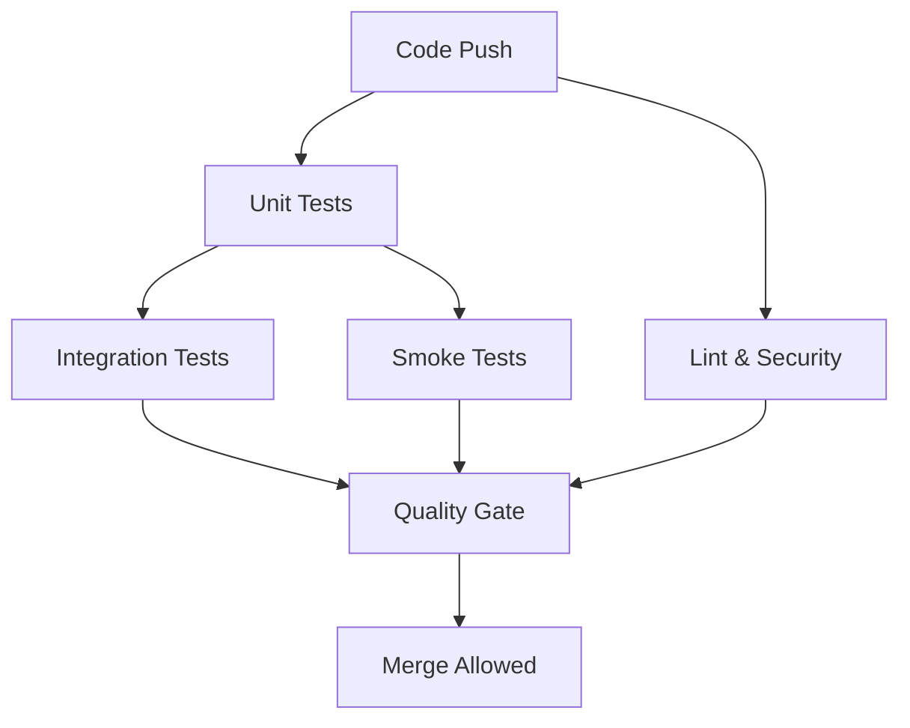

# AccessiWeather Testing Framework

This document describes the comprehensive testing framework implemented for the AccessiWeather project, including test categories, execution strategies, and performance optimization.

## Overview

The AccessiWeather testing framework is designed to provide:
- **Fast feedback** for developers during development
- **Comprehensive coverage** for CI/CD pipelines
- **Categorized test execution** for different scenarios
- **Performance optimization** for quick iteration

## Test Categories

### Test Markers

The framework uses pytest markers to categorize tests:

| Marker | Description | Execution Time | Coverage |
|--------|-------------|----------------|----------|
| `unit` | Fast, isolated unit tests | < 1 second each | Yes |
| `integration` | Component interaction tests | 1-5 seconds each | No |
| `gui` | wxPython GUI component tests | 2-10 seconds each | No |
| `e2e` | End-to-end workflow tests | 5-30 seconds each | No |
| `smoke` | Basic functionality verification | < 5 seconds each | No |
| `slow` | Tests taking > 5 seconds | > 5 seconds each | No |
| `api` | External API interaction tests | Variable | No |
| `network` | Network-dependent tests | Variable | No |

### Test Organization

```
tests/
├── test_*.py              # Unit tests (root level)
├── api/                   # API-specific tests
│   └── test_*.py
├── gui/                   # GUI component tests
│   └── test_*.py
├── services/              # Service layer tests
│   └── test_*.py
├── utils/                 # Utility function tests
│   └── test_*.py
└── test_e2e_smoke.py      # End-to-end smoke tests
```

## Running Tests

### Using the Test Runner Script

The project includes a comprehensive test runner script:

```bash
# Run unit tests with coverage
python scripts/run_tests.py unit

# Run integration tests
python scripts/run_tests.py integration

# Run GUI tests
python scripts/run_tests.py gui

# Run end-to-end tests
python scripts/run_tests.py e2e

# Run smoke tests
python scripts/run_tests.py smoke

# Run fast tests only (excludes slow tests)
python scripts/run_tests.py fast

# Run all tests
python scripts/run_tests.py all
```

### Using pytest Directly

```bash
# Run unit tests
pytest -m "unit" -v

# Run fast tests with coverage
pytest -m "not slow" -v --cov=src/accessiweather

# Run GUI tests
pytest -m "gui" -v

# Run integration tests
pytest -m "integration" -v

# Run smoke tests
pytest -m "smoke" -v

# Run specific test file
pytest tests/test_api_client.py -v

# Run tests with specific markers
pytest -m "unit and api" -v
```

## Test Environment Configuration

### Environment Variables

The framework uses specific environment variables for different execution modes:

#### Local Development
```bash
ACCESSIWEATHER_TEST_MODE=1
PYTHONPATH=src
```

#### CI/CD Environment
```bash
DISPLAY=""                          # Headless mode
PYTEST_DISABLE_PLUGIN_AUTOLOAD=1   # Disable plugin autoload
ACCESSIWEATHER_TEST_MODE=1          # Test mode flag
CI=true                             # CI environment flag
PYTHONPATH=src                      # Python path
```

### Test Configuration

The `scripts/test_config.py` module provides centralized configuration for:
- Test execution timeouts
- Parallel execution settings
- Coverage reporting options
- Environment setup

## Performance Optimization

### Parallel Execution

- **Unit tests**: Run in parallel using pytest-xdist
- **Integration/GUI tests**: Run sequentially (thread safety)
- **E2E tests**: Run sequentially (resource intensive)

### Fast Feedback Mode

For rapid development iteration:
```bash
# Fail fast mode - stops on first failure
python scripts/run_tests.py unit --quiet

# Run only changed tests (with pytest-testmon)
pytest --testmon -v
```

### Test Timeouts

Each test category has configured timeouts:
- Unit tests: 5 minutes
- Integration tests: 10 minutes
- GUI tests: 15 minutes
- E2E tests: 20 minutes
- Smoke tests: 3 minutes

## CI/CD Integration

### GitHub Actions Workflow

The CI pipeline includes multiple test jobs:

1. **Unit Tests** (`test` job)
   - Runs fast unit tests with coverage
   - Matrix testing on Python 3.11 and 3.12
   - Uploads coverage reports

2. **Integration Tests** (`integration` job)
   - Runs integration and GUI tests
   - Depends on unit tests passing

3. **Smoke Tests** (`smoke` job)
   - Runs basic functionality verification
   - Quick validation of core features

4. **Quality Gate** (`quality-gate` job)
   - Validates all test jobs passed
   - Blocks merge if any tests fail

### Test Execution Flow



## Writing Tests

### Test Markers

Always add appropriate markers to new tests:

```python
import pytest

@pytest.mark.unit
def test_simple_function():
    """Test a simple function."""
    assert simple_function() == expected_result

@pytest.mark.integration
@pytest.mark.api
def test_api_integration():
    """Test API integration."""
    # Test code here

@pytest.mark.gui
@pytest.mark.slow
def test_gui_component():
    """Test GUI component (may be slow)."""
    # GUI test code here

@pytest.mark.e2e
@pytest.mark.smoke
def test_application_startup():
    """Test application can start up."""
    # E2E test code here
```

### Test Naming Conventions

- Test files: `test_*.py`
- Test classes: `Test*`
- Test functions: `test_*`
- Descriptive names that explain what is being tested

### Fixtures and Mocking

Use pytest fixtures for common test setup:

```python
@pytest.fixture
def mock_api_client():
    """Create a mock API client."""
    return MagicMock(spec=NoaaApiClient)

@pytest.fixture
def sample_weather_data():
    """Provide sample weather data for tests."""
    return {"temperature": 72, "condition": "sunny"}
```

## Coverage Requirements

- **Unit tests**: Minimum 80% coverage
- **Integration tests**: Focus on component interactions
- **E2E tests**: Focus on user workflows
- **Overall project**: Target 85%+ coverage

## Troubleshooting

### Common Issues

1. **GUI Tests Failing in Headless Mode**
   - Ensure `DISPLAY=""` is set
   - Use mocking for wxPython components
   - Avoid creating actual GUI windows

2. **Slow Test Performance**
   - Add `@pytest.mark.slow` marker
   - Consider mocking external dependencies
   - Use fixtures to reduce setup time

3. **Flaky Tests**
   - Add appropriate timeouts
   - Mock time-dependent operations
   - Use deterministic test data

### Debug Mode

Run tests with additional debugging:

```bash
# Verbose output with debugging
pytest -v -s --tb=long

# Run specific test with debugging
pytest tests/test_specific.py::test_function -v -s

# Run with coverage and HTML report
pytest --cov=src/accessiweather --cov-report=html -v
```

## Best Practices

1. **Test Isolation**: Each test should be independent
2. **Fast Unit Tests**: Keep unit tests under 1 second
3. **Meaningful Assertions**: Use descriptive assertion messages
4. **Mock External Dependencies**: Don't rely on external services
5. **Test Edge Cases**: Include error conditions and boundary cases
6. **Readable Tests**: Write tests that serve as documentation

## Future Enhancements

- **Property-based testing** with Hypothesis
- **Mutation testing** for test quality validation
- **Performance regression testing**
- **Visual regression testing** for GUI components
- **Contract testing** for API interactions
